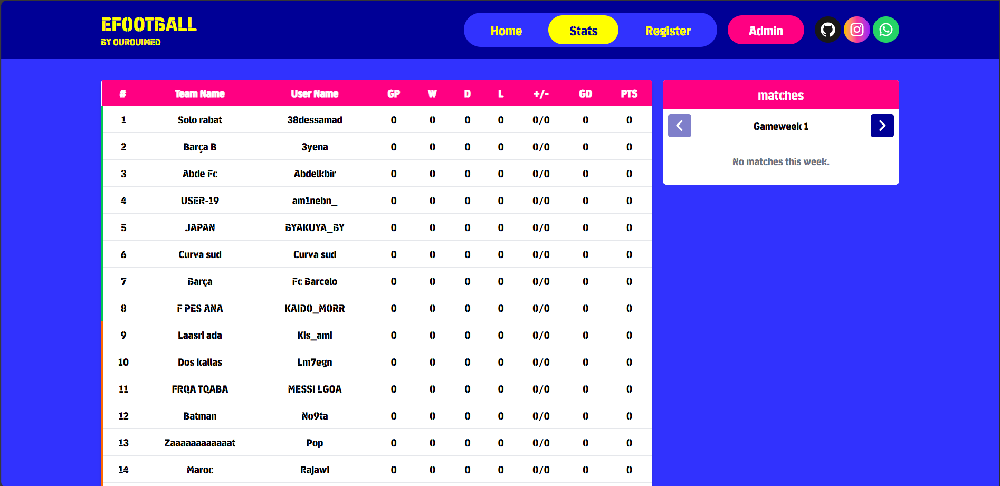
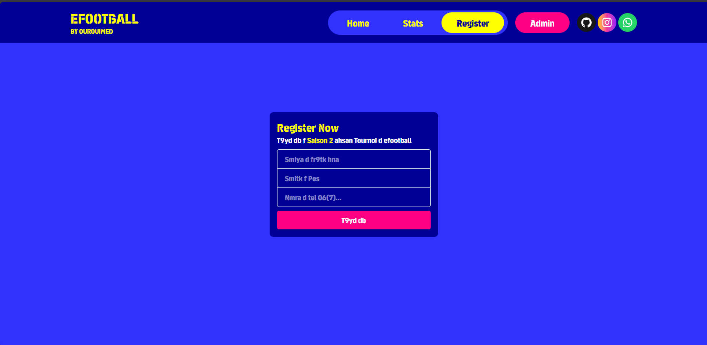
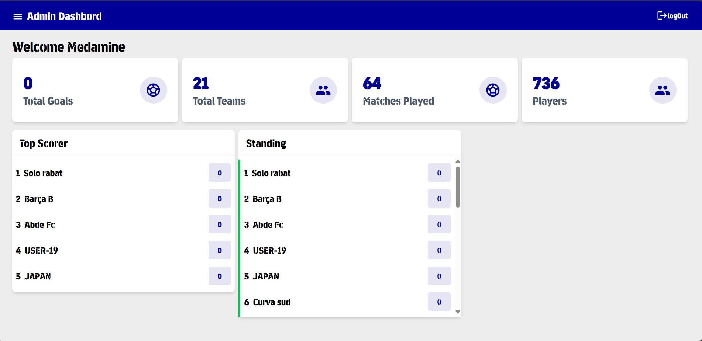
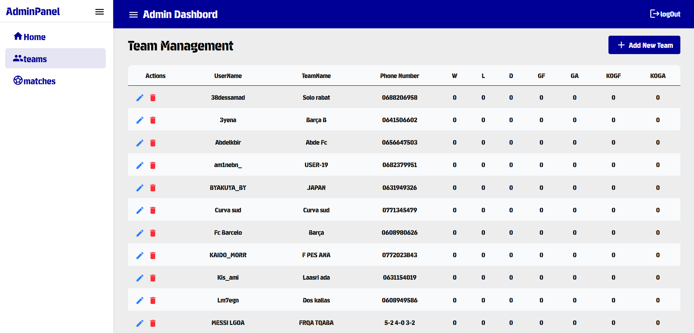
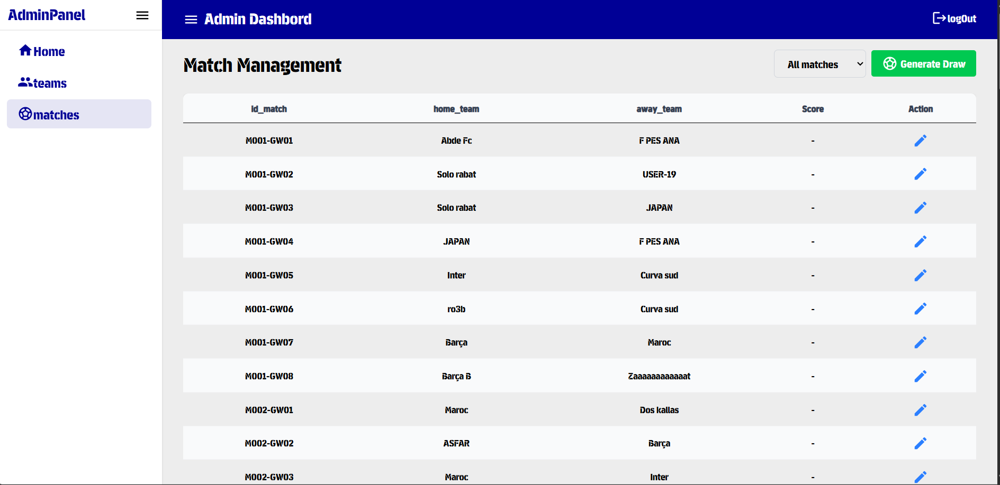
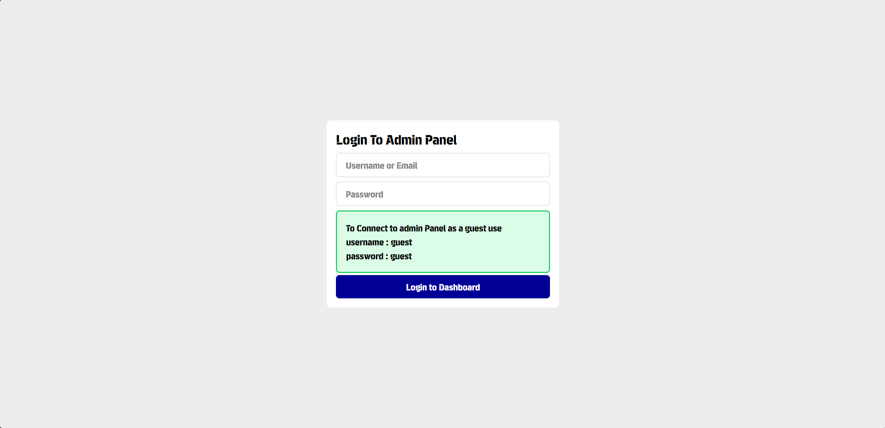

# ⚽ eFootball27 Tournament System

This is my first full-stack web application for managing football teams and scores participating in a tournament for the football video game **eFootball**. It is built with **React (Vite)** on the frontend and **Express + MySQL** on the backend.

---

## 🚀 Features

- 🧑‍💼 **Admin Authentication**  
  Session-based login to protect sensitive actions.

- ⚙️ **Full Team Management**  
  Add, update, and delete teams. Track team statistics:
  - Wins, Losses, Draws
  - Goals For/Against
  - Knockout Round Progress (soon)

- 🏆 **Match Management**  
  - Generate random matches between teams
  - Update match scores
  - Automatically update team stats accordingly

- 🧠 **Smart Score Updates**  
  - Reverts previous match effects before applying new scores

- 🖥️ **Responsive UI**  
  Built with Tailwind CSS + MUI Icons for a modern look

- 🔒 **Session Verification**  
  Protected routes and features using session validation

---

## 🧰 Tech Stack

| Layer        | Tech                        |
|--------------|-----------------------------|
| Frontend     | React + Vite                |
| UI Components| Tailwind CSS + MUI Icons    |
| Backend      | Express.js                  |
| Database     | MySQL                       |

---

## 🛠️ Installation & Usage

To run this project locally:

### I. Clone the Repository

```bash
git clone https://github.com/Ourouimed/efootball25.git
```
### II - frontend Setup
```bash
cd frontend
npm install
```
Create a `.env` file in the `frontend` directory and fil it with your backend_api_url:
```env
VITE_API_URL=your_api_url #default http://localhost:3001
```
Then start the server:
```bash
npm run dev 
```
- Open your browser at: http://localhost:5173

### III - Backend Setup

```bash
cd backend
npm install
```
1 - Create your database and use `efootball.sql` script to create the tables:

2 - Create a `.env` file in the `backend` directory and fil it with your Mysql database credentials:
```env
PORT=3001
DB_HOST=your_mysql_host
DB_USER=your_mysql_user
DB_PASSWORD=your_mysql_password
DB_NAME=your_database_name
ALLOW_CORS_URL = your_frontend_url #default http://localhost:5173
```


Then start the server:
```bash
npm start
```
- Backend runs at: http://localhost:3001


## 📂 Project Structure

```bash
efootball25/
├── backend/                       # Backend-related files and logic
│   ├── config/db.js               # Mysql Database configuration
│   ├── middelware/corsOptions.js  # Cors Configuration
│   ├── controllers/               # App Controllers
│   │   ├── authController.js      # Authentication-related controllers
│   │   ├── teamController.js      # Team-related controllers
│   │   ├── matchController.js     # Match-related controllers
│   │   └── drawController.js      # Draw-related controllers
│   ├── models/                    # Models 
│   │   ├── Auth.js                # Authentication-related Model
│   │   ├── Match.js               # Team-related Model
│   │   └── Team.js                # Draw-related Model
│   ├── routes/                    # Routes
│   │   ├── auth.js                # Authentication route
│   │   ├── draw.js                # Team route
│   │   ├── matches.js             # Match route
│   │   └── teams.js               # Draw route
│   ├── utils/                     # utils functions 
│   │   ├── matchGenerator.js      # Random draw function
│   │   └── sessionCodeGenerator.js  # Random Session code function
│   ├── .env                       # Environment variables for backend (e.g., database credentials)
│   ├── server.js                   # Main entry point for the Express app
│   ├── package-lock.json          # Automatically generated lock file for backend dependencies
│   ├── package.json               # Backend dependencies, scripts, and metadata
│   └── vercel.json                # Vercel deployment configuration for backend
│
├── frontend/                      # Frontend-related files
│   ├── src/
│   │   ├── admin/                 # Admin panel-specific files and components
│   │   │   ├── components/        # Reusable components used in the admin panel (e.g., Navbar, StatsCard)
│   │   │   ├── pages/             # Admin panel-specific page components (e.g., Dashboard, Login)
│   │   ├── assets/                # Static assets like images, fonts, and other resources
│   │   ├── components/            # General reusable components (e.g., Header, MenuHome)
│   │   ├── pages/                 # Page components for user-facing views (e.g., Stats, Register)
│   │   ├── contexts/              # Context providers for managing shared state (e.g., SideNavContext)
│   │   ├── App.jsx                # Main entry point of the React app, including routing and context providers
│   │   ├── main.jsx               # Entry point for Vite (renders the React app)
│   │   ├── index.css              # Global styles using Tailwind CSS
│   │   └── .env                   # Frontend environment variables (e.g., API_URL for backend)
│   ├── .gitignore                 # Specifies files/folders to ignore in version control
│   ├── eslint.config.js           # ESLint configuration for linting frontend code
│   ├── index.html                 # Main HTML file for the frontend app
│   ├── vercel.json                # Vercel deployment configuration for frontend
│   ├── vite.config.json           # Configuration for Vite, the build tool
│   ├── package-lock.json          # Automatically generated lock file for frontend dependencies
│   └── package.json               # Frontend dependencies, scripts, and metadata
│
├── .gitignore                     # Specifies files/folders to ignore in version control for the entire project
└── README.md                      # Project documentation, setup instructions, and features overview
```
### 📷 Demo and Screenshots

#### Home Pages Overview
Below are the screenshots showing the general view of the homepage:





#### Admin Dashboard Overview
Here are the screenshots showcasing the admin dashboard interface:





